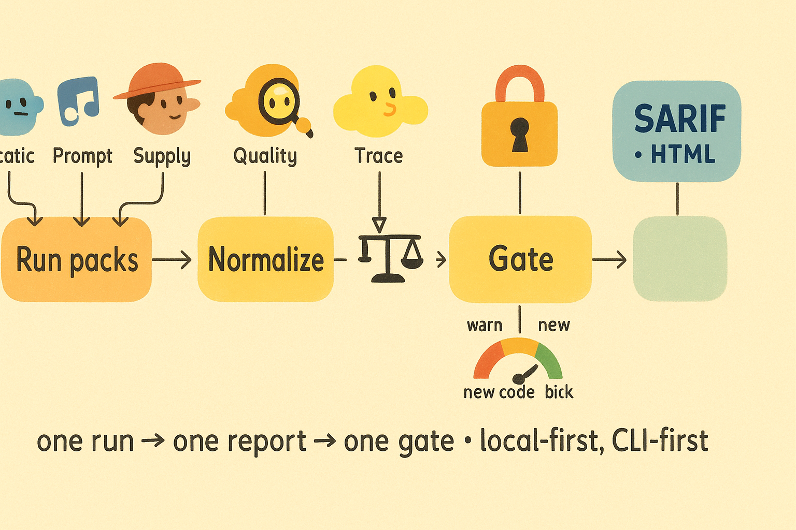

# Genticode 🧬

> Policy‑driven guardrails for AI‑assisted coding: one run, one report, one gate.

[](LICENSE)

**Status:** v0.97.0‑beta “Water Spider”

Genticode reduces risk and noise when coding with AI. IDE‑neutral, CLI‑first, local‑first. Python and TypeScript/JavaScript first‑class. Single normalized report for CI gates.

---

## TL;DR value
- **Lessons Loop** turns failures into better future runs without weakening tests.
- **Single artifact** (`.genticode/report.json`) → SARIF + HTML for PRs.
- **Baselines & budgets**: only new issues fail the build.
- **Prompt hygiene**: track prompt‑like strings and prevent drift.
- **Policy presets**: _lite_, _team_, _regulated_ (switchable).
- **Deterministic**: same inputs → same outputs.

<p align="center">
  
</p>

---

## Quick win in 5 minutes

```bash
python -m venv .venv && source .venv/bin/activate
pip install -r requirements-dev.txt
genticode init                      # creates .genticode/*
genticode check                     # run packs
genticode baseline capture          # record today's state
genticode report --html             # render a human report
open .genticode/report.html
```

Minimal policy (`.genticode/policy.yaml`):

```yaml
version: 1
packs:
  static: {enabled: true, timeout_s: 600}
  supply: {enabled: true, timeout_s: 600}
  quality: {enabled: true, timeout_s: 1800}
  traceability: {enabled: true, timeout_s: 120}
severity_map: {info: 0, low: 20, medium: 50, high: 80, critical: 95}
budgets:
  secrets: {max_total: 0}
  licenses: {deny: [AGPL-3.0], fail_on_unknown: true}
progressive_enforcement: {phase: new_code_only}
```

---

## What Genticode does

- **Packs**: Static (SAST+secrets), Supply (SBOM+licenses+vulns), Quality (linters+flakes), Trace (AC↔tests), Prompt hygiene.
- **Normalize**: one schema across tools.
- **Gate**: budgets + progressive phases (warn → new‑code‑only → block).
- **Outputs**: JSON → SARIF → HTML. Everything is reproducible.

<p align="center">
  
</p>

---

## How it fits your AI workflow

Use Genticode **alongside** Copilot, Cursor, Continue, or your agent.
- Keep coding as usual. Run `genticode check` locally or in CI.
- **Prompt hygiene** extracts prompt‑like strings, IDs them, and detects drift.
- **MPI mindset**: gate on minimum‑plausible implementation by budget and policy.
- **No IDE lock‑in**: SARIF annotates PRs; HTML for humans.

<p align="center">
  
</p>

---

## The Lessons Loop (central)

A multi‑pass, evidence‑driven loop to improve outcomes **without test nerfs**.

1. Run full suite once per attempt with timeouts.
2. Adjudicate failures using strict branches: **CODE_FIX**, **TEST_UPDATE** (must cite requirement), **HARNESS_UPDATE**, **FLAKY**, **REQUIREMENT_GAP**, **KNOWN_FAIL**.
3. Write 5‑Whys lessons; merge into `LESSONS_CURRENT.md`.
4. Reset to pre‑sprint tag; rebuild with lessons; retry. Cap attempts; split scope if repeats.
5. Test edits require waivers; deletions blocked.

<p align="center">
  
</p>

---

## Policy phases and budgets

- Phases: **warn** → **new‑code‑only** → **block**.
- Budgets: secrets=0, deny AGPL, unknown license=fail, custom SAST thresholds.
- Baselines ensure old debt doesn’t stop progress.

<p align="center">
  
</p>

### Presets (DX)
Switch between presets instead of hand‑editing YAML.
```yaml
preset: lite      # lite|team|regulated
```
- **lite**: warn‑only, fast checks.
- **team**: new‑code‑only gates, SBOM on CI.
- **regulated**: hard gates, evidence bundles.

---

## Example: catching AI “confidence” bugs

> A refactor suggestion imported a non‑existent helper and removed an invariant check.

Genticode surfaced:
- **Static**: unresolved import.
- **Trace**: AC mismatch vs tests.
- **Quality**: flake in async wait.
- Gate failed in **new‑code‑only**; Lessons added “never remove invariant X; add unit test Y.” Second attempt passed without weakening tests.

---

## Integrations

- **CI**: GitHub Actions/other CI via `genticode check && genticode gate`.
- **PR review**: upload SARIF; link HTML report.
- **Pre‑commit**: run fast packs locally; enforce secrets=0.
- **SBOM**: CycloneDX; license policy in budgets.

---

## Roadmap highlights

- **Telemetry + Mistakes DB**: empirical hints from your own history.
- **Batching & ordering**: safe, deterministic, telemetry‑aware.
- **TUI polish**: guided onboarding, presets selector, dashboard.

---

## Contributing

- Keep coverage ≥95% for changed code.
- Run `scripts/guard.sh` before pushing; never commit secrets.
- Include an AC checklist in PRs and link to `.genticode/report.html` when relevant.

## License

MIT — see [LICENSE](LICENSE).
